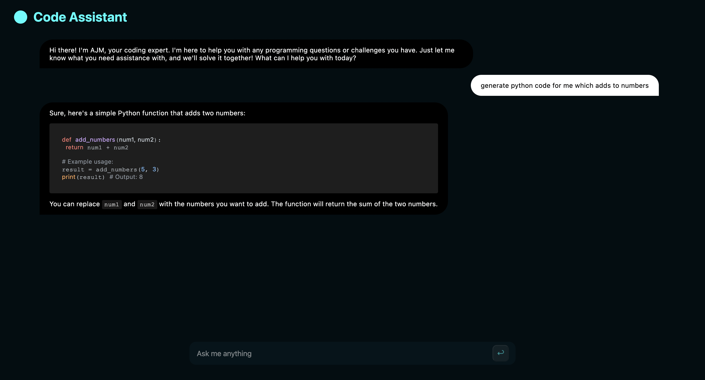

# AI Coding Assistant with Minimal UI

Welcome to the AI Coding Assistant project for my third week at the Headstarter AI Fellowship 2024! This project uses Next.js and NextUI to create a minimal UI-based coding chatbot. The chatbot leverages the Mistral 7B model for chat completion, providing accurate and efficient coding assistance.

## Features

- **Minimal UI**: Simple and clean user interface built with NextUI.
- **Chat Completion**: Utilizes the Mistral 7B model for providing coding assistance.
- **Next.js**: Framework for building the application.
- **Streaming**: Chat completion implementated with streaming for optimized performance in fetching responses. 

## Vercel Deployment 

The project is deployed using Vercel and is accessible at https://code-assistant-eight.vercel.app/

## Preview

